---
name:董佩杰
class:软件工程1603班
studentNo:2016012963
---

# 实验三 JavaScript编程

```
name:董佩杰
class:软件工程1603班
studentNo:2016012963
```
## 一、实验目的

1. 掌握JavaScript的基本语法
2. 掌握JavaScript的常用内置对象的作用、属性、方法的运用
3. 掌握 JavaScript的程序流程控制语句的运用
4. 理解Javascrip中对象的基本概念
5. 掌握常用的Javascrip内置对象及其属性、方法等
6. 掌握Javascrip中事件处理的方法
7. 掌握BOM和DOM模型中的常见对象及其属性、方法
8. 掌握JQuery框架的基本应用

## 二、实习题目 

- 编写JavaScript程序实现 “九九乘法表”

  ```html
  <html>

  <head>
      <title> LIANG CHAO HUI 666</title>
  </head>

  <body>
      <table style="border-collapse: collapse;border:2px;">
          <script type="text/javascript">
              for (i = 1; i < 10; i++) {
                  document.write("<tr>");
                  for (j = 1; j < 10; j++) {
                      if (j <= i) document.write("<td style='border:2px solid #004B8A;background:white;'>"+
                          i + "*" + j + "="+(i * j) + "</td>");
                      else document.write("<td style='border:none;'></td>")
                  }
                  document.write("</tr>")
              }

          </script>
      </table>
      <hr style="border:2px solid #GGGGGG"/>
      <table style="border:1px">
          <script type="text/javascript">
              for(var i = 9 ; i >= 0 ; i--)
                  {
                      document.write("<tr>")
                      for(var j = 1 ; j <= i ; j++)
                          {
                              document.write("<td style='border:2px solid #000000;background:yellow;'>" + i + "*" + j + "=" + (i*j) + "</td>")
                          }
                      document.write("</tr>")
                  }
          </script>
      </table>
  </body>

  </html>

  ```

  #### 实现的结果：

  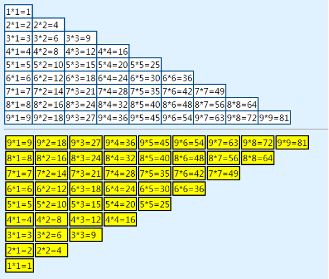

- 编写函数实现生成指定行数和列数的表格（行数和列数通过函数参数传递）

```html
<html>
    
    <head>
    <title> TITLE </title>
    <style type="text/css">
        td {
            border: 2px solid #99ffff;
            align-content: center;
        }

        tr {
            border: 2px;
            background-color: aqua;
        }

    </style>
    <script>
        function myfun(r, c) {
            a=parseInt(r.value)
            b=parseInt(c.value)
            document.write("<h1>" + " 表格生成器 " + "</h1>")
            document.write('<table style="border-collapse: collapse;border:2px solid black;width:100%;">')
            for (i = 1; i <= a; i++) {
                document.write("<tr>")
                for (j = 1; j <= b; j++) {
                    document.write("<td style='border:2px solid #ff6666;width:45px;height:30px;'>" + "table" + "</td>")
                }
                document.write("</tr>")
            }
            document.write("</table>")
        }
    </script>
</head>


<body>
    <h1>表格生成器</h1>
    <h3>Please enter rows and cols:</h3>
    <form>
        <table>
            <tr>
                <td>rows:</td>
                <td><input type="text" name="r" /></td>
            </tr>
            <tr>
                <td>cols:</td>
                <td><input type="text" name="c" /></td>
            </tr>
        </table>
        &nbsp;&nbsp;&nbsp;&nbsp;&nbsp;&nbsp;&nbsp;&nbsp;&nbsp;&nbsp;&nbsp;&nbsp;&nbsp;&nbsp;&nbsp;&nbsp;&nbsp;&nbsp;&nbsp;&nbsp;&nbsp;&nbsp;&nbsp;&nbsp;&nbsp;&nbsp;&nbsp;&nbsp;&nbsp;&nbsp;&nbsp;&nbsp;
        <input type="button" onclick="myfun(r,c)" value="生成表格" />
        <br/>
    </form>
</body>

</html>
```


#### 得到结果:

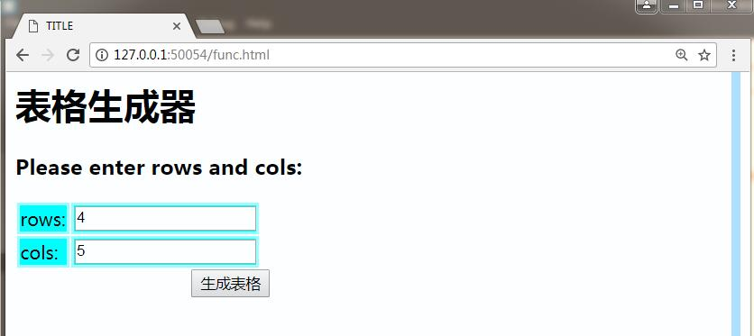

> 点击按钮以后效果

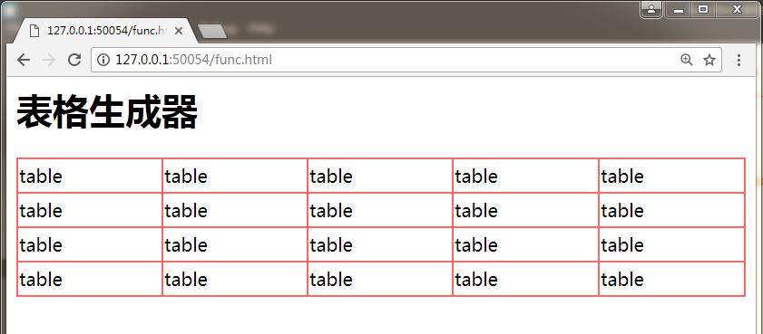

- 利用Date对象编写程序，判断并输出今天是开学的第几周，星期几

```html
<html>

<head>
    <title> Date Calculate</title>
</head>
<script type="text/javascript">
    function TodayInfo() {
        var start = new Date(2018, 1, 25, 0, 0, 0, 0);
        var now = new Date();
        var cha = now.getTime() - start.getTime();
        cha = (cha / 604800000);
        cha = Math.ceil(cha);
        alert("开学时间：" + start.toLocaleDateString() + "\n" + "现在时间：" + now.toLocaleDateString() + "\n" + "现在是第" + cha.toString() + "周的星期" + (now.getDay()).toString());
    }
</script>

<body>
    <h2> 本学期时间计算：</h2>
    <p>下面的按钮可以计算从开学以来，今天是第几周，星期几：</p>
    <button onclick="TodayInfo()">Calculate Date</button>
</body>

</html>

```

结果：

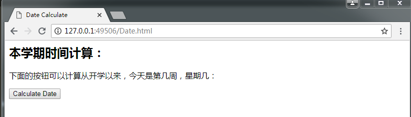

点击按钮以后：

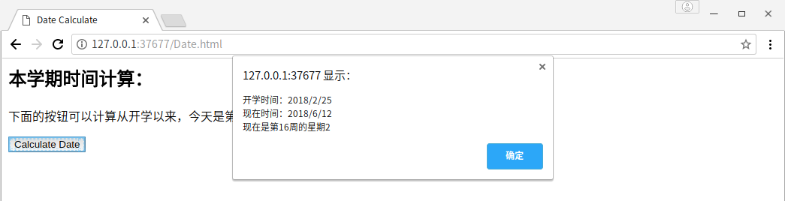


- 编写程序，利用正则表达式输出待处理英文单词或词组的首字母。如"blue idea"输出"bi"，"Asynchronous JavaScript And XML"输出"AJAX"(不包括引号)

```html
<html>

<head>
    <title>regex</title>
    <script type="text/javascript">
        function func() {
            var s = document.getElementById("jss").value;
            var regex = /\b[A-Za-z]/g;
            var arr = s.match(regex);
            var str = "";
            for (var i = 0; i < arr.length; i++)
                str = str + arr[i];
            alert(str);
        }
    </script>

</head>
<center>
    <h3>取字符串首字母</h3>
    <hr/>
    <br/>
    <form>
        请输入字符串(英文):
        <input type="text" id="jss" />
        <input type="button" value="begin" onclick="func()" />
    </form>
</center>

</html>

```

结果：

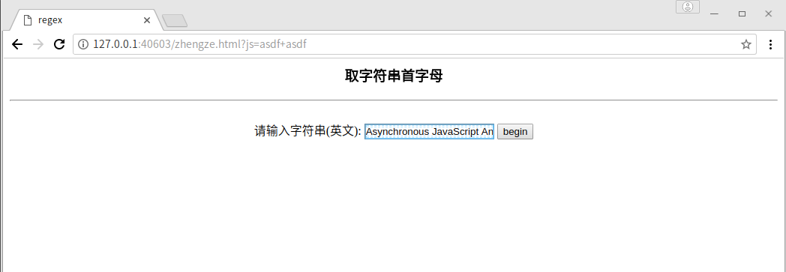

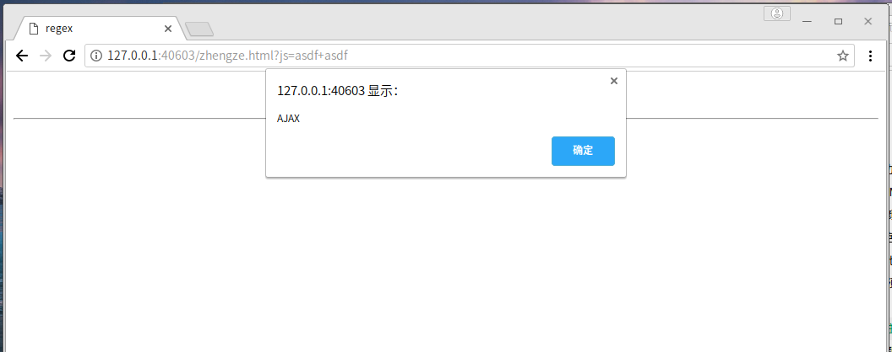


- 设计一个网页，输入一串用英文逗号分隔的数字字符串。编写程序，输出找出该组数中的最大、最小值、和 。并按从大到小排序后的输出结果（以逗号分隔）

主要利用的是讲字符串分割为字符串数组的方法：split()方法

```html
<html>
    <head>
    <title>数字字符串的处理</title>
    <script type="text/javascript">
        function $(id) {
            return document.getElementById(id);
        }

        function process() {
            var mathstr = document.getElementById("mathstr").value;
            var arr = mathstr.split(",");
            var mx = -10000;
            var mn = 10000;
            var sum = 0;
            for (var i = 0; i < arr.length; i++) {
                if (mx < parseInt(arr[i]))
                    mx = parseInt(arr[i]);
                if (mn > parseInt(arr[i]))
                    mn = parseInt(arr[i]);
                sum = sum + parseInt(arr[i]);
            }
            document.getElementById("max").value = mx.toString();
            document.getElementById("min").value = mn.toString();
            document.getElementById("sum").value = sum.toString();
        }
    </script>
</head>

<body>
    <h3>点击下边按钮，进行数字字符串的处理</h3>
    <form name="form1">
        <fieldset>
            <legend>请在这里输入一串字符串
            </legend>
            &nbsp;&nbsp;&nbsp;&nbsp;&nbsp;&nbsp;&nbsp; 数字字符串： &nbsp;&nbsp;&nbsp;&nbsp;&nbsp;
            <input type="text" name="input1" value="" align="middle" id="mathstr" /> &nbsp;&nbsp;&nbsp;&nbsp;&nbsp;
            <input type="button" onclick="process()" value="Process the String"> 

        </fieldset>
        <fieldset>
            <legend>
                Max, Min Sum结果
            </legend>
            &nbsp;&nbsp;&nbsp;&nbsp;Max:
            <input type="text" id="max" readonly/> &nbsp;&nbsp;&nbsp;&nbsp;Min:
            <input type="text" id="min" readonly/> &nbsp;&nbsp;&nbsp;&nbsp;Sum:
            <input type="text" id="sum" readonly/>
        </fieldset>
    </form>
</body>

</html>
```

结果：

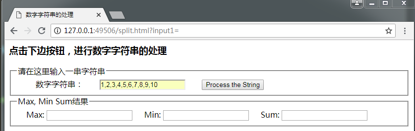

点击以后：

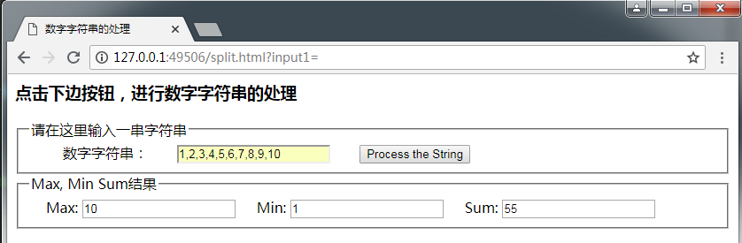

- 要求用户在文本框中年份，点击判断按钮，用alert函数输出该年是否是闰年的结果

```html
<html>

<head>
    <title>judge jun nian</title>
</head>

<body style="background-color: aliceblue;">
    <script type="text/javascript">
        function isLeapYear() {
            var getyear = document.getElementById("ttt");
            year = parseInt(getyear.value);

            var a = year % 4;
            var b = year % 100;
            var c = year % 400;
            if (((a == 0) && (b != 0)) || (c == 0)) {
                alert(year + "是闰年");
            } else {
                alert(year + "不是闰年");
            }
        }
    </script>
    <h3 align="center">计算是否为闰年</h3>
    <hr/>
    <center>
        <form name="form1" method="post" action="">
            <input name="textfield" type="text" size="6" id="ttt" maxlength="4">
            <input type="button" value="计算是否为闰年" onclick="isLeapYear()" />
        </form>
    </center>
</body>

</html>

```

结果：

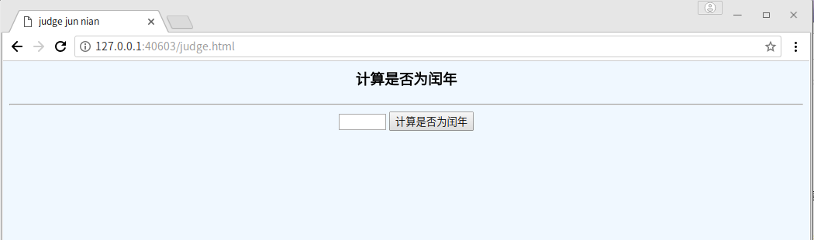

> 输入2000

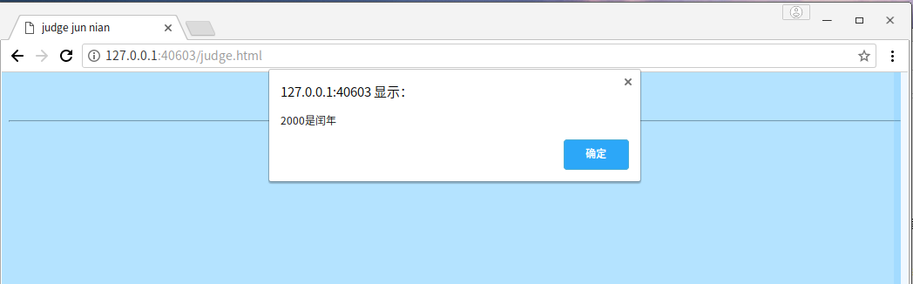

> 输入2018

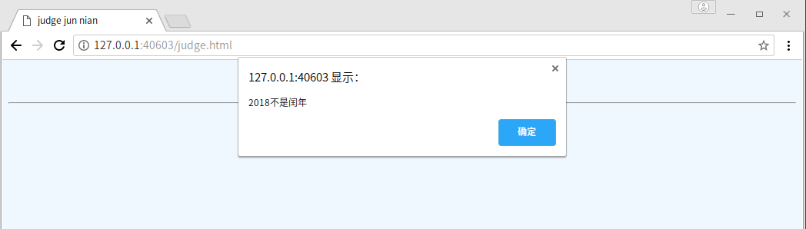

- 利用复选框让用户选择其爱好，用alert对话框输出用户所选的内容。 

  ```html
  <html>
      
      <head>
      <title>
          爱好选择
      </title>
  </head>

  <body>
      <h3>爱好选择器</h3>
      <form name=frmLx2>
          <input type="checkbox" name="chkAH" value="篮球">篮球<br>
          <input type="checkbox" name="chkAH" value="足球">足球<br>
          <input type="checkbox" name="chkAH" value="排球">排球<br>
          <input type="checkbox" name="chkAH" value="乒乓球">乒乓球<br>
          <input type="button" onClick="funGo1()" value="OK">
      </form>
      <script>
          function funGo1() {
              var chk = document.frmLx2.chkAH;
              var str = "";
              for (var i = 0; i < chk.length; i++) {
                  if (document.frmLx2.chkAH[i].checked) {
                      str = str + document.frmLx2.chkAH[i].value;
                      str = str + ",";
                  }
              }
              alert("您的爱好有:" + str);
          }
      </script>
  </body>
  </html>

  ```

  结果：

  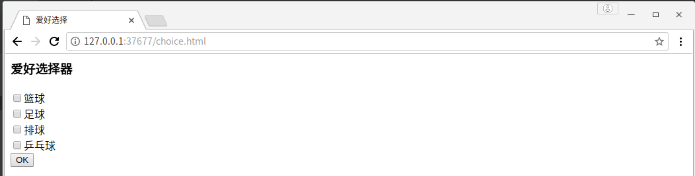


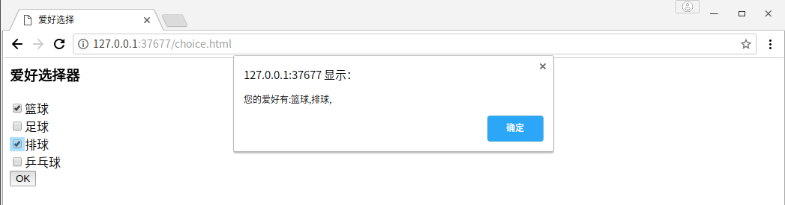


- 要求在文本框中输入用户名，点击“注册”按钮进行提交。当文本框为空时，则弹出提示信息，并取消提交操作

```html
<html>
<head>
    <title>登录</title>
</head>

<body>
    <form name="frmLx1" method="post" onSubmit="funcheck()">姓名：<input type="text" name="txtName"><br/><br/>
        <input type="submit" value="注册" />
        <input type="reset" value="重置" />
    </form>
    <script>
        function funcheck() {
            if (document.frmLx1.txtName.value == "") {
                alert("输入为空，取消操作");
            } else {
                alert("已经成功提交");
            }
        }
    </script>
</body>
</html>
```

结果：

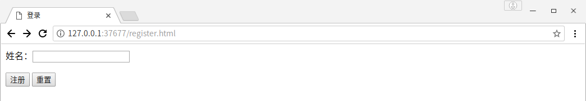

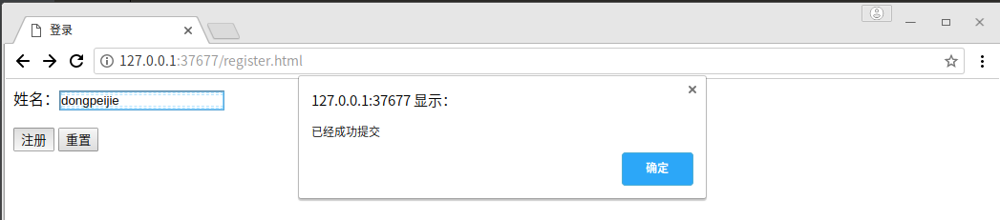

- 在打开网页后弹出一个宽200,高300的窗口,且在该网页关闭后，弹出的窗口也关闭

```html
<html>
	<head>
	<title> 弹出窗口</title>
	<script>
		var window;

		function funopen() {
			window = open("judge.html", "窗口名称", width = 200, height = 300)
		}

		function funclose() {
			window.close();
		}
	</script>
</head>

<body onload="funopen()" onunload="funclose()">

</body>
	
</html>
```

结果：


- 直接利用Javascript操作DOM模型，将当前目录下的10张图片循环显示在网页上（cycle.html）

```javascript
<html>
	<head>
	<title>Cycler</title>
	<script>
		var banners = ["./pic/01.jpg", "./pic/02.jpg", "./pic/03.jpg", "./pic/04.jpg", "./pic/05.jpg"]; // 图片地址
		var counter = 1;

		function run() {
			setInterval(cycle, 1000); //重复运行cycle函数，周期1000ms
		}

		function cycle() {
			counter++;
			if (counter == banners.length)
				counter = 0;
			document.getElementById("cpic").src = banners[counter];
		}
	</script>
</head>

<body onload="run();">
	<h2 align="center">请欣赏美妙的风景</h2>
	<center>
		<div style="align-items: center;border:20px;padding: 20px;background-color:aquamarine;
		<height:></height:>336px;width:496px;">
			


		</div>

	</center>
</body>
</html>
```

结果：

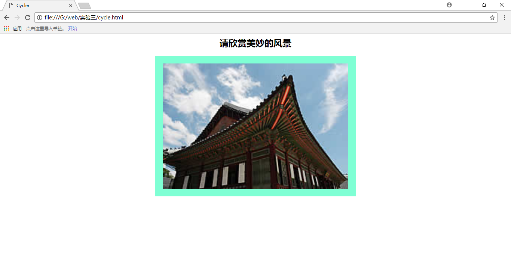

- 利用JQuery编写程序，将当前目录下的10张图片循环显示在网页上

```html
<html>

<head>
	<script type="text/javascript" src="jquery-3.3.1.js"></script>
	<style>
		#div1 ul {
			position: absolute;
			left: 0;
			border: 2px;
		}

		#div1 ul li {
			float: left;
			padding: 10px;
			list-style: none;
			background-color: aqua;
		}
	</style>
	<script type="text/javascript">
		var banners = ["./pic/1-0.jpg", "./pic/1-1.jpg", "./pic/1-2.jpg", "./pic/1-3.jpg", "./pic/1-4.jpg", "./pic/1-5.jpg", "./pic/1-6.jpg", "./pic/1-7.jpg", "./pic/1-8.jpg", "./pic/1-9.jpg"];
		var cnter = 0;

		function onld() {
			setInterval(cycle, 1000);
		}

		function cycle() {
			$("#img1").attr('src', banners[(cnter + 1) % banners.length]);
			cnter = (cnter + 1) % banners.length;
			$("#img2").attr('src', banners[(cnter + 1) % banners.length]);
			cnter = (cnter + 1) % banners.length;
			$("#img3").attr('src', banners[(cnter + 1) % banners.length]);
			cnter = (cnter + 1) % banners.length;
			$("#img4").attr('src', banners[(cnter + 1) % banners.length]);
			cnter = (cnter + 1) % banners.length;
		}
	</script>
</head>

<body onload="onld()">
	<br/>
	<h1 align="center">让图片循环出现在下方</h1>
	<center>
		<div class="div1" id="div1">
			<ul>
				<li id="li1"></li>
				<li id="li2"></li>
				<li id="li3"></li>
				<li id="li4"></li>
			</ul>
		</div>
	</center>
</body>

</html>
```

结果：

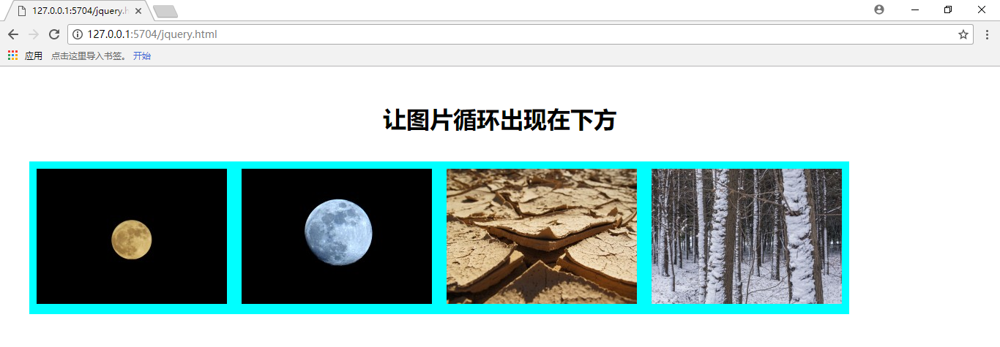

- 在状态栏上显示，访问者在本页停留的时间（如：您在本页停留了X小时X分X秒）

```html
<html>

<head>
	<meta http-equiv="Content-Type" content="text/html; charset=utf-8" />
	<title>计时</title>
</head>

<body onload="timeCount()">
	<script type="text/javascript">
		var second = 0;
		var minute = 0;
		var hour = 0;

		function timeCount() {
			second = second + 1;
			setTimeout("timeCount()", 1000);
			while (second >= 60) {
				minute = minute + 1;
				second = 0;
				while (minute >= 60) {
					hour = hour + 1;
					minute = 0;
					second = 0;
					if(hour == 24)
						hour = 0;
				}
			}
			window.status = "你在本网页停留了" + hour + "小时" + minute + "分" + second + "秒";
		}
	</script>
	
	<button onclick="timeCount()">开始计时</button>
</body>

</html>
```

---

## 三、 实验总结

1. 本次实验做的时间比较长，JavaScript语言掌握不够熟练，其中的用法需要不断查阅书，参考相似的题目。由于没有报错，所以需要对语法特别熟悉，调试过程也比较麻烦。
2. jQuery部分掌握的不是很灵活，这部分语法也比较多，在编写过程中也遇到了许多困难，通过查阅jQuery的语法得到了解决
3. 正则表达式处理部分，比较容易，在匹配了逗号，然后将所有的数字文本存放在一个数组中，然后进行转化，然后就是简单的操作。
4. 本次实习中涉及了Javascript相关用法，还有DOM BOM，jquery，正则表达式相关用法，增强了我对前端的理解，提升了我的水平。

