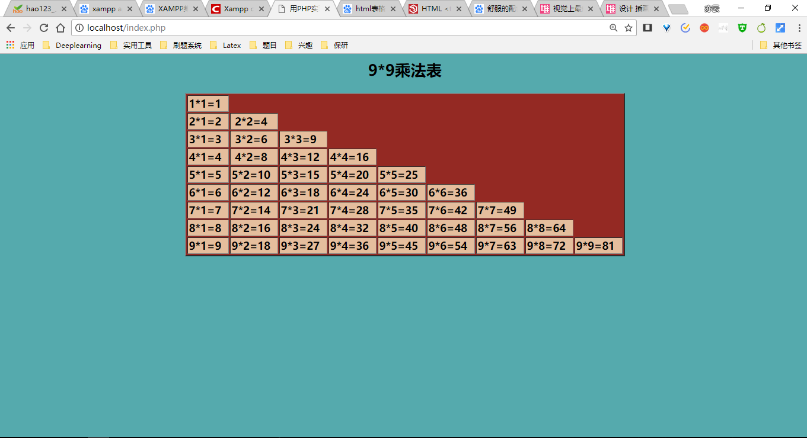
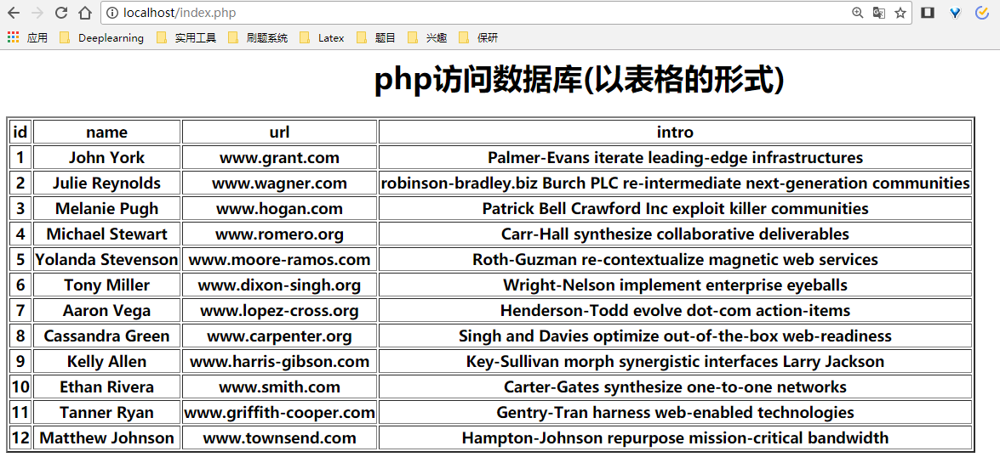
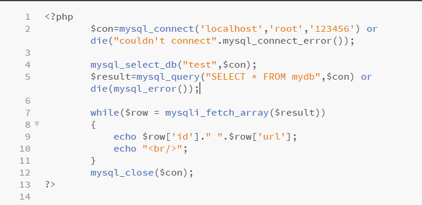

---
name:董佩杰
class:软件工程1603班
studentNo:2016012963
---
# 实验四-PHP编程

```
name:董佩杰
class:软件工程1603班
studentNo:2016012963
```

## 一、实验目的

1. 掌握PHP开发运行环境的建立。
2. 掌握PHP程序的基本语法。
3. 了解PHP访问mysql数据库的方法。


## 二、实习题目


### 第一题

> 下载并安装最新版本XAMPP软件:XAMPP的详细安装过程

#### 1. 下载XAMPP

- 安装环境：windows10
- 下载软件为：xampp-win32-7.2.6-0-VC15-installer.exe

#### 2. 开始安装

选择要安装的目录即可开始安装

#### 3. 修改apache的访问目录为你的站点

打开.. /xampp/apache/conf/httpd.conf

- 找到DirectoryIndex行，该行代表你的默认起始    页面：DirectoryIndex  index.htm index.php
- 找到DocumentRoot行 ，该行代表你的网站目录，将其修改为你的网站目录，如：DocumentRoot “D:/myPHP”

#### 4. 错误处理

> 1. 遇到的问题：没有权限
>
>    处理方法：点击右键，属性，安全，更改文件的权限

> 2. 遇到的问题：Apache无法正常启动
>
>    - 处理方法：修改httpd.conf 中的listen选项，80改为其他没有被占用的端口
>    - 修改httpd-ssl.conf 中的listen选项，将443改为其他没有被占用的端口
>
>    另外的处理方法：(将占用端口的程序kill,本电脑由于安装了虚拟机，导致了443端口的占用)
>
>    - netstat -ano | findstr 443 //列出进程极其占用的端口，且包含 443
>    - tasklist | findstr 9268
>    - taskkill -PID <进程号> -F //强制关闭某个进程
>
> 3. 1045 Access denied for user
>
>    处理方法：
>
> - 先关掉mysql服务，
>
> - 然后找到mysql bin目录下的my.ini文件，在[mysql]下面加上 skip-grant-tables  用于跳过密码 
>
> - 进入cmd，重置密码 
>
>   - mysql -uroot -p  回车
>
>     不用管password 回车
>
>     use mysql;   回车
>
>     修改密码：set password for 'root'@'localhost'=password('新密码');
>
>     flush privilegs;  刷新数据库
>
>     quit;
>
> - 修改my.ini 注释掉skip-grant-tables;保存退出 

### 第二题

> 编写程序，输出“九九乘法表”.

```php+HTML
<html>

<head>
	<title>用PHP实现9*9乘法表</title>
</head>
<h2 align="center">9*9乘法表</h2>

<body style="background-color:rgb(85,170,173);">
	<table border="2px" align="center" style="background-color:rgb(148,41,35);">
		<?php
			for($i = 1; $i <= 9 ; $i++){		
				echo "<tr style='background-color:rgb(229,190,157);'>";
				for($j = 1; $j <= $i ; $j++)
				{
					echo "<th>".$i."*".$j."=".$i*$j."&nbsp;&nbsp;</th>";
				}
				echo "</tr>";
			}
		?>
	</table>
</body>

</html>
```

结果：



### 第三题

安装MySQL数据库。test

​	数据库安装完成后，创建一个新的数据库(mydb)，并创建一个数据表(test)并录入一些测试数据。mytable表结构如下：


 用PHP编写代码访问数据库，将test表中数据显示在网页上。

代码如下：

```php+HTML
<html>

<head>
	<title>php访问数据库</title>
</head>

<body style="bgcolor:#83f">
	<h1 align="center">php访问数据库(以表格的形式)</h1>
	<table border="2px" style="align:center;">
		<?php
		$con=mysql_connect('127.0.0.1','root','123456') or die("couldn't connect".mysql_connect_error());
	
		mysql_select_db("test",$con);
		$result=mysql_query("select * from mydb") or die(mysql_error());
		echo "<tr>";
		echo "<th>id</th>";
		echo "<th>name</th>";
		echo "<th>url</th>";
		echo "<th>intro</th>";
		echo "</tr>";
		while($row = mysql_fetch_array($result))
		{
			echo "<tr>";
			echo "<th>".$row['id']."</th>";
			echo "<th>".$row['name']."</th>";
			echo "<th>".$row['url']."</th>";
			echo "<th>".$row['intro']."</th>";
			echo "</tr>";
		}	
		mysql_close($con);
?>
	</table>
</body>

</html>
```

结果：（其中的数据是随机生成的没有意义）



## 实验总结

1. 本次实习中主要困难在于xampp的安装以及navicat的使用，在xampp的安装过程中，出现了端口占用的经典问题，通过修改配置文件得到了解决。由于自己电脑本身的问题，所在的programFiles文件夹中的文件对我的用户上锁了，导致了不能对在该文件夹中的内容进行修改，所以在这个文件夹安装的xampp就会出现很多意想不到的问题。最后通过修改文件夹权限解决了，赋予了本用户对该文件夹的所有权限。
2. 第二个主要的困难在于在数据库的使用，navicat的使用问题


在最后一个问题中出现了以下警告，对第七行的信息报错

随后问过老师以后发现不应该是mysqli_fetch_array,而应该实时mysql_fetch_array,解决了问题。

在这个过程中，经常遇到使用navicat的时候出现2003和1045报错

2003报错是因为没有开启mysql服务，1045报错是因为没有访问数据库的权限，通过网上的教程得到了解决。

3. 在这个实习过程中，我遇见了很多报错与问题，但是我也学会了很多东西，比如window下修改文件权限，配置mysql文件，能基本解决了问题，在这个过程中也得到了老师的帮助，感谢老师。